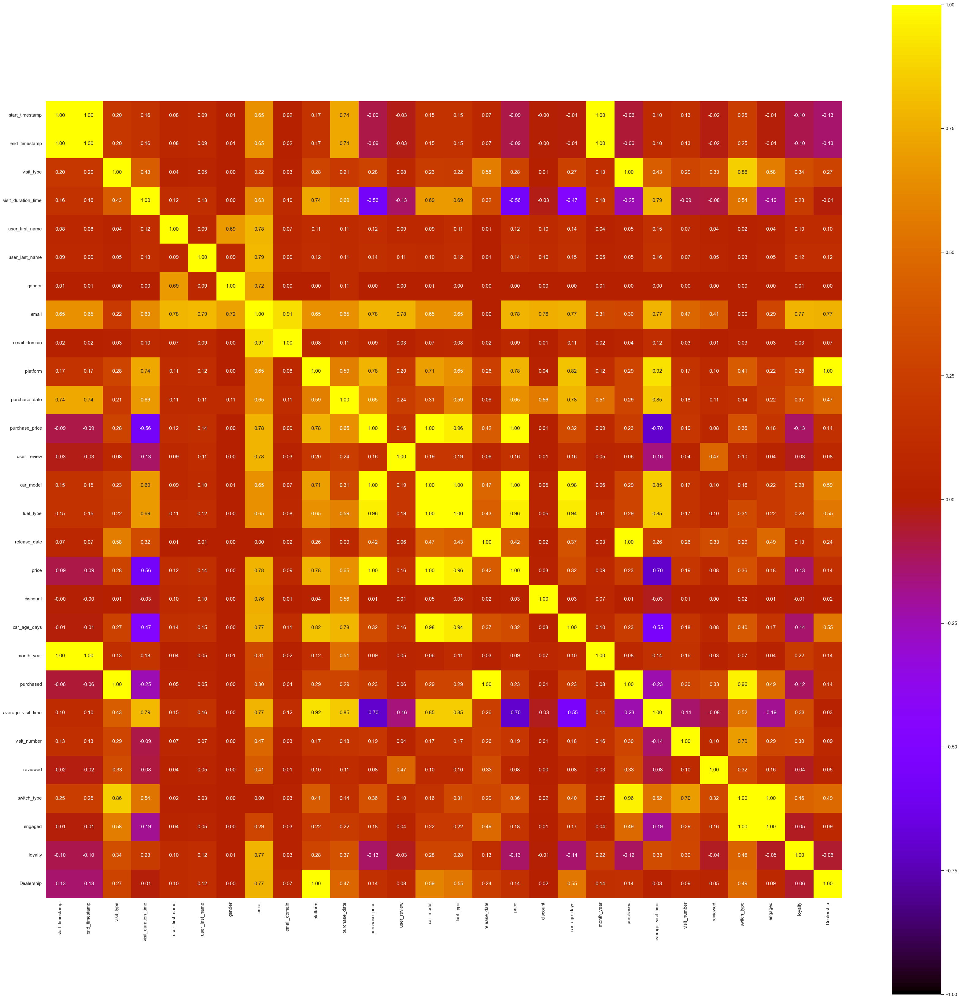

## Objectives

* Describe the datasets and the eventual anomalies you find.
* Which patterns do you find in the purchasing behavior of the customers?
* Conduct a thorough exploratory data analysis to understand the datasets.
* Perform customer segmentation to cluster users based on their interactions and purchasing behaviors on the different platforms.
* Investigate the types of cars (e.g., electric, hybrid, diesel) preferred on each platform and how this correlates with the platform's sales performance and user satisfaction.
* (optional) Open-ended exploration: you can explore the datasets further and propose additional analyses, modeling, visualizations, or insights.

# What I've founded

- The avaiable period goes from the 25 June 2020 to the end of January 2024
- The strange user-review pattern releated to the dealership
- Every platform have a different best seller, and since the price is strongly related to the fuel type this affects the sales performance quite a lot

