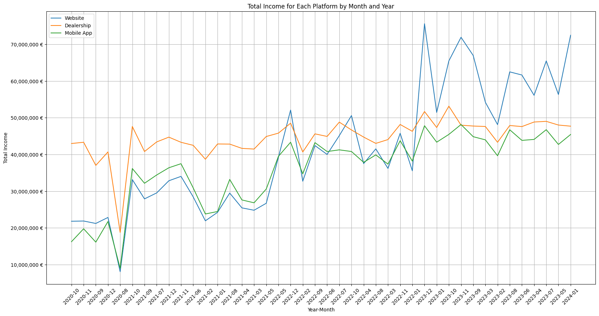

# Internship-Case-2024-DEC (BMW)

This project was designed to demonstrate my expertise in data science, with a focus on automotive e-commerce analytics, as part of my journey toward securing an internship at BMW.

Below, I’ve included the most insightful charts below, highlighting important aspects of the dataset.

## Objectives:

* Describe the datasets and the eventual anomalies you find.
* Which patterns do you find in the purchasing behavior of the customers?
* Conduct a thorough exploratory data analysis to understand the datasets.
* Perform customer segmentation to cluster users based on their interactions and purchasing behaviors on the different platforms.
* Investigate the types of cars (e.g., electric, hybrid, diesel) preferred on each platform and how this correlates with the platform's sales performance and user satisfaction.
* (optional) Open-ended exploration: you can explore the datasets further and propose additional analyses, modeling, visualizations, or insights.

## What I've founded

* The data analyzed goes from June 25, 2020, to the end of January 2024.
* A notable pattern was observed in user reviews, which appear to vary uniquely depending on the platform and the specific month.
* Each platform exhibits a distinct best-selling vehicle, with sales performance heavily influenced by the relationship between fuel type and pricing.
* User behavior allows for a predictive model with reasonable accuracy to determine both the likelihood of a purchase and the sentiment of a future review. This insight is crucial for optimizing website navigation, enhancing user experience, and increasing conversion rates from visits to purchases.
* Analysis revealed four distinct customer clusters, offering deeper insights into consumer behavior and preferences.

## Some of the most interesting graph

### Cars.csv

### Users.csv

### Sales.csv

### Visits.csv

